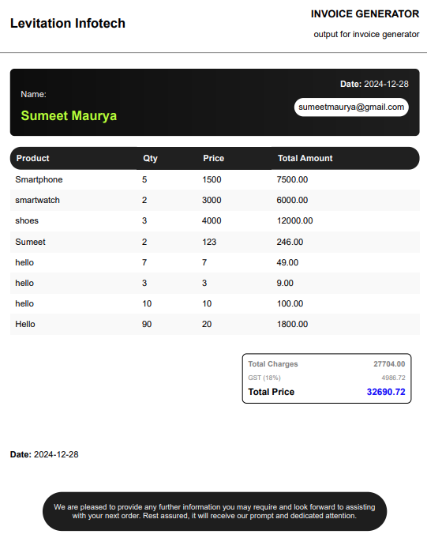

# Invoice Maker Backend

This is the backend for invoice maker. Follow the usage instructions to setup your own.

# Expected Result


## Requirements

Make sure you have the following software installed on your system:

- [Node.js](https://nodejs.org/) - JavaScript runtime environment
- [npm](https://www.npmjs.com/) or [Yarn](https://yarnpkg.com/) - Package managers for Node.js
- [MongoDB CLI](https://docs.mongodb.com/manual/installation/) (optional) - If you want to connect to a MongoDB database on your local system.

## Usage

Follow these steps to get started with this starter kit:

1. Clone the project to your local machine:

   ```shell
   git clone git@github.com:SumeetMaurya3/InvoiceMakerBackend.git
   ```

2. Navigate to the project directory:

   ```shell
   cd InvoiceMakerBackend
   ```

3. Install the required dependencies using either Yarn or npm:

   ```shell
   yarn
   # or
   npm install
   ```

4. Create a copy of the `.env.example` file and name it `.env`:

   ```shell
   cp .env.example .env
   ```

5. Configure the environment variables in the `.env` file according to your project's requirements. This file stores sensitive information like database credentials and API keys, so make sure to keep it secure.

6. Start the development server:

   ```shell
   yarn dev
   # or
   npm run dev
   ```

Now, your Node.js server is up and running!

## License

This starter kit is available under the [MIT License](LICENSE). Feel free to use it as a foundation for your Node.js projects.